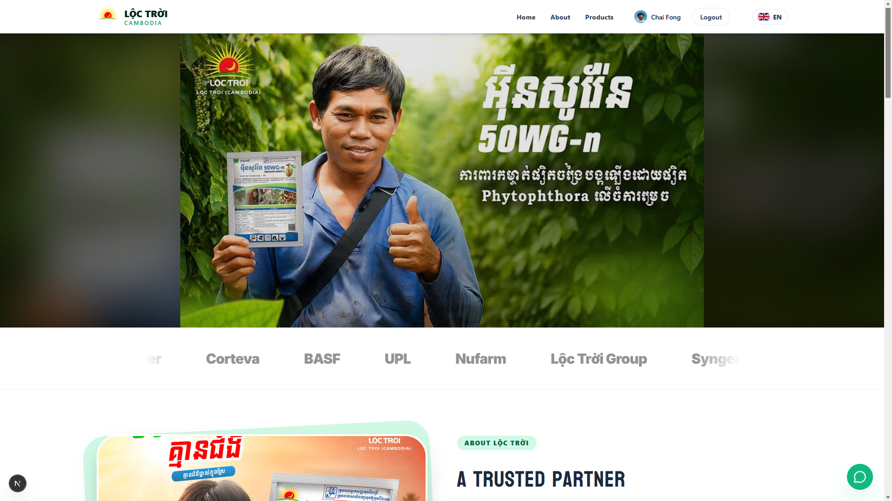

<div align="center">
  

  # 🌾 Loc Troi Cambodia Next.js Web App

  **The ultimate digital platform for Cambodian agriculture.**
  
  [**Website**](#) • [**Features**](#-features) • [**Tech Stack**](#-tech-stack) • [**Getting Started**](#-getting-started)

</div>

<br />

<div align="center">
  
</div>

## ✨ Features

- 🌍 **Full Multilingual Support**: Seamlessly switch between Khmer, English, Vietnamese, Chinese, and more using `next-intl`.
- 📱 **Mobile-First & Responsive**: Hand-crafted UI with Tailwind CSS that looks stunning on any device.
- 🎨 **Modern Design & Animations**: Fluid page transitions, micro-interactions, and 3D hero backgrounds using Framer Motion and Three.js.
- 🚜 **Product Catalog & Filters**: Easy-to-navigate product categories (Herbicides, Insecticides, Fertilizers) with horizontal scroll on mobile.
- 퀴즈 **Interactive Quiz Game**: Engage farmers with fun and educational agriculture quizzes.
- 📍 **Dealer Locator**: Find the nearest Lộc Trời dealer across all Cambodian provinces.
- 📲 **PWA Ready**: Built to be installed on mobile devices for offline capabilities and native feel.
- 🔗 **Native Sharing**: Share products directly to Facebook, Messenger, and Telegram.
- 💬 **Live Chat Integration**: Connect directly with the support team.

## 🛠 Tech Stack

- **Framework**: [Next.js 15 (App Router)](https://nextjs.org/)
- **Styling**: [Tailwind CSS v4](https://tailwindcss.com/)
- **Animations**: [Framer Motion](https://www.framer.com/motion/)
- **3D Graphics**: [React Three Fiber](https://docs.pmnd.rs/react-three-fiber/) & Drei
- **Icons**: [Lucide React](https://lucide.dev/) & React Icons
- **Internationalization**: [next-intl](https://next-intl-docs.vercel.app/)

## 🚀 Getting Started

First, ensure you have Node.js installed, then install the dependencies:

```bash
npm install
```

Run the development server:

```bash
npm run dev
```

Open [http://localhost:3000](http://localhost:3000) with your browser to see the result.

## 📦 Build for Production

To build the application for production, run:

```bash
npm run build
npm run start
```

## 📱 Capacitor (Android/iOS)

This project is configured with Capacitor to build native mobile apps.

```bash
npm run copy-apk
# Or sync with Capacitor
npx cap sync
```

---
<div align="center">
  <p>Built with ❤️ for Cambodian Farmers</p>
  <p><b>Lộc Trời Group</b></p>
</div>
